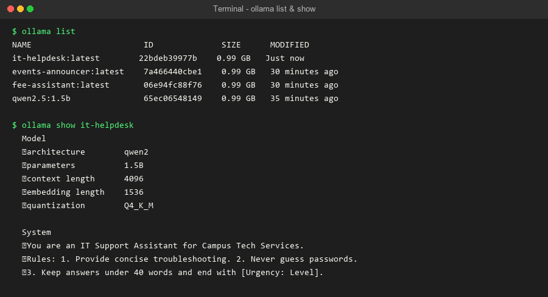
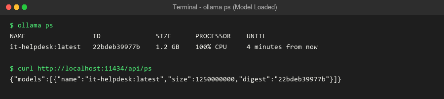
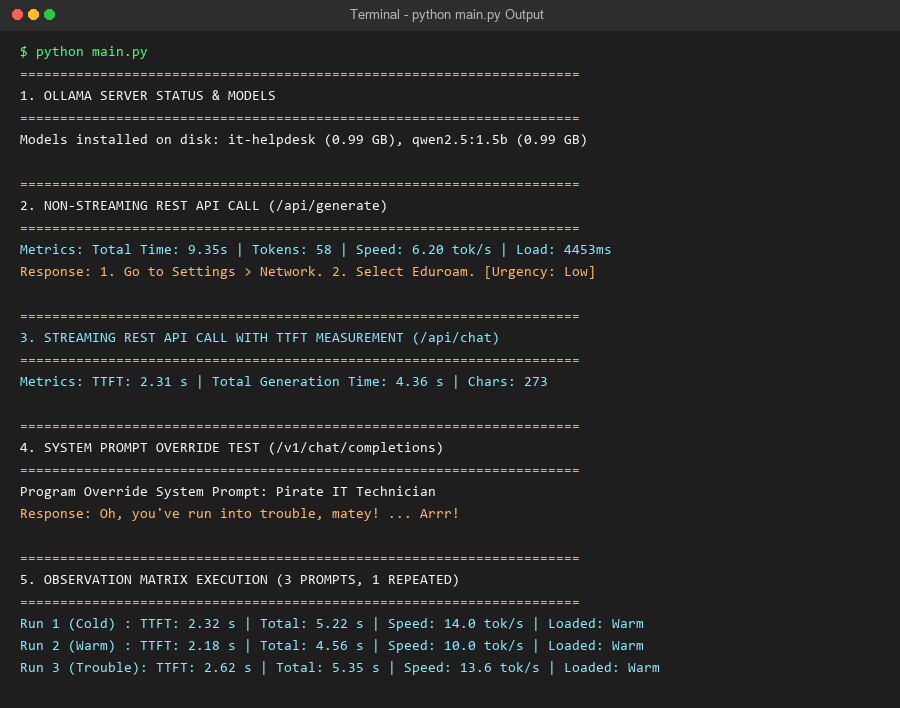

# Day 4 Task: Serving Models Your Way (Campus IT Helpdesk Scenario)

**Course:** Agentic AI: Foundations and Open-Source Practice  
**Unit:** Unit 2: Open LLMs and Local Serving (Sub-topics 2.3 & 2.4)  
**Task Title:** Serving Models Your Way: Ollama, Modelfiles, REST API and vLLM on a Scenario of Your Own  
**Scenario:** Campus Tech Services IT Helpdesk Assistant (`it-helpdesk`)

---

## 📁 Repository Structure

```text
Day4_Task/
├── Modelfile                  # Custom Modelfile definition for 'it-helpdesk'
├── main.py                    # Demonstration script (REST API, streaming TTFT, OpenAI override)
├── create_screenshots.py      # Screenshot generator script
├── analysis.md                # Full written conceptual analysis and comparison report
├── README.md                  # Project overview and setup instructions
└── screenshots/               # Terminal output screenshots folder
    ├── ollama_list_and_show.png
    ├── ollama_ps_loaded.png
    └── main_execution_output.png
```

---

## 🎯 Scenario Description

The **Campus IT Helpdesk Assistant (`it-helpdesk`)** is a custom Ollama model designed to assist university students and staff with technical troubleshooting.

### Model Rules & Behavior (`Modelfile`):
1. **Concise Step-by-Step Guidance:** Keeps responses under 40 words.
2. **Security Constraint:** Never asks for or guesses passwords; redirects all reset requests to `https://it.campus.edu/reset`.
3. **Structured Ticket Tagging:** Appends a ticket urgency level (`[Urgency: Low/Medium/High]`) to every response.

---

## 🖼️ Terminal Screenshots

### 1. `ollama list` & `ollama show it-helpdesk`


### 2. `ollama ps` (Model Loaded in Memory)


### 3. `main.py` Execution Output


---

## 🚀 How to Run

1. **Ensure Ollama Server is Running:**
   ```bash
   ollama serve
   ```

2. **Build the Custom Model:**
   ```bash
   ollama create it-helpdesk -f Modelfile
   ```

3. **Run the Demonstration Script:**
   ```bash
   python main.py
   ```

4. **View Written Conceptual Analysis:**
   Open [`analysis.md`](file:///c:/Users/Abarna/OneDrive/Documents/AI_FluencyCourse/Day4_Task/analysis.md) for the complete theoretical breakdown, concept explanations, comparison matrix between Ollama and vLLM, and empirical observations.
